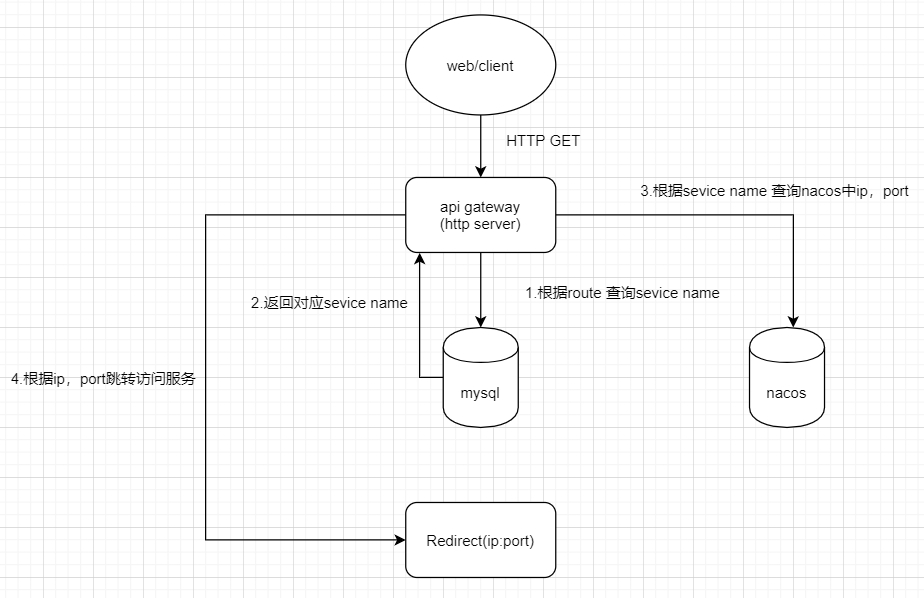

# api gateway
## 开发需求
* 1.路由管理
* 2.请求转发
* 3.负载均衡(未开始)
* 4.黑白名单(未开始)
* 5.日志管理(未开始)
## 实现网关前的准备 
### 1.使用docker搭建本地nacos
* 1.拉取nacos镜像
```shell
docker pull nacos/nacos-server
```
* 2.创建容器网络
* 实现容器之间的通信和数据交换。创建容器网络可以提高容器之间的隔离性，并简化容器的网络配置和管理。
```shell
docker network create nacos_network
```
* 3.启动nacos
* 这个命令会启动一个名为 nacos 的容器，并将其绑定到本地机器的 8848 端口。同时，它还会将容器添加到之前创建的 nacos_network 容器网络中，并设置容器模式为 standalone。
```shell
docker run --name nacos -d \
-p 8848:8848 \
--network nacos_network \
-e MODE=standalone \
nacos/nacos-server
```
* 4.再次启动
```shell
docker start -a nacos
```
### 2.注册服务
* 1.使用nacos注册工具 注册服务demo.go
## 网关代码实现
### 1.连接数据库 查询记录的route与service_name对应关系，得到service_name
### 2.连接nacos 根据service_name 查询对应IP,Port
### 3.跳转操作(后续如果是内网服务 可以转为proxy)
* 

## 接口设计
* 目前的接口 post /test --> demo.go
## route注册的解决方法
* 动态监听：当增加服务时自动在mysql中生成对应的route(查询了依赖库 不支持此操作)
* 解决方法2：制作一个小程序 远程连接数据库 向数据库插入将注册的服务名
