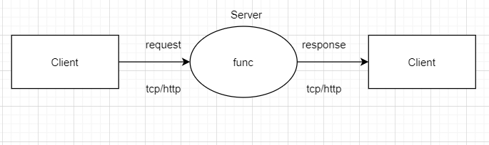

# daily part1
更新了installer手册，使用了RPC基础功能
# daily part2
## 使用RPC有以下几个重要规则：
* 1.结构体字段首字母要大写，可以别人调用。**注：结构体中的参数同样需要大写**
* 2.函数名必须首字母大写
* 3.函数第一参数是接收参数，第二个参数是返回给客户端的参数，必须是指针类型
* 4.函数还必须有一个返回值error
* 否则会出现以下错误
```
 gob: type main.Requests has no exported fields
```
## RPC服务注册后服务处理绑定到http协议上，为什么要绑定在http协议上？还可以绑定在其他协议上吗？有什么区别？
* 用HTTP的广泛支持，使得RPC调用可以通过标准的HTTP请求和响应来进行传输，无需额外的协议或库。
* 当然，除了HTTP协议，还可以将服务处理绑定到其他协议上，例如gRPC使用的是自定义的二进制协议。不同的协议在传输方式、性能、安全性等方面可能有所不同。
* 区别主要在于：
* 1.传输方式：HTTP协议使用文本格式的请求和响应，可以通过标准的HTTP库和工具进行调试和监控。而其他协议可能使用二进制格式，需要使用对应的库和工具进行处理。
* 2.性能：不同的协议在性能方面可能有所差异，例如gRPC使用的二进制协议可以提供更高的性能和较小的传输开销。
* 3.安全性：HTTP协议可以通过HTTPS进行加密传输，提供一定的安全性。而其他协议可能有自己的安全机制，例如gRPC使用TLS进行传输加密。
# 关于RPC的理解
* 关于RPC协议 所谓的远程方法调用 看起来只是把调用方Client的参数传给被调用方Server执行方法后传回，如下图
* 
* 那么实现跨语言是不是只要使用统一序列化就可以解决了呢 -- protocol
# daily part3
* 使用gRPC框架
* 与protocol合并使用
