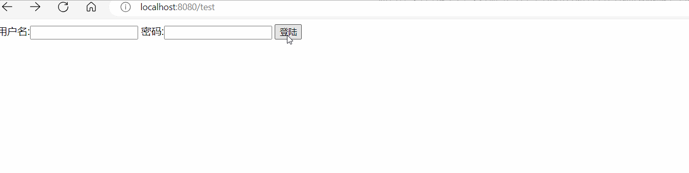
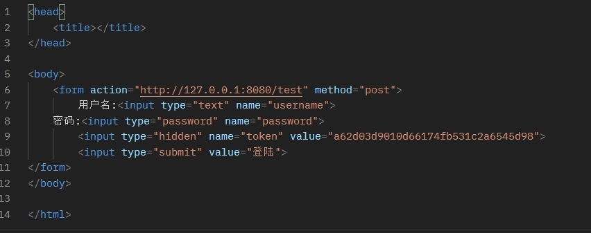

# 用go语言实现一个图书管理系统过程
## 1.http server搭建
```
http.ListenAndServe(":8080", handler)
```
* 该方法完成监听端口(listen)并处理进入端口的连接(serve)
### 关于handler
* 设置handler就是设置处理的程序
* 定义handler仅需要实现ServeHTTP(ResponseWriter, *Request)接口即可
```
// 设置handler
type handlerImp struct {
}

func (imp handlerImp) ServeHTTP(w http.ResponseWriter, r *http.Request) {
	w.Write([]byte("Hello, World!"))
}

func main() {
	http.ListenAndServe(":8080", handlerImp{})
}
```
* 设置路由的方法：在ServerHTTP中加入if r.URL.PATH == "/test"
* 当有多个路由或接口方法时，所有的执行逻辑都要通过ServeHTTP来完成，违反了高内聚低耦合
### 组合设计模式：
* 概念：组合模式是一种结构型的设计模式，你可以使用它将对象组合成树状结构，并且能像使用独立对象一样使用他们（指组合体）
* 优势：1.将类与对象组装成一个较大的结构并同时保持结构的灵活与高效性
* 	2.组合模式还符合开闭原则，不用修改原本的代码就可以添加新功能
* 
* 结构：
```
 ————handler
          ————method
          ————path
                ————/test
                ————/login
```
#### 1.定义抽象组件接口 包含了对路径和HTTP方法的处理程序的存储和调用逻辑。
```
type handlerImp struct {
	pathHandlers   map[string]http.Handler
	methodHandlers map[string]http.Handler
}
```
#### 2.实现叶子对象
```
func main() {
	
	handler := NewHandlerImp()
 	// 一个叶节点
	handler.AddPathHandler("/test", http.HandlerFunc(func(w http.ResponseWriter, r *http.Request) {
		fmt.Fprint(w, "Hello, World!")
	}))
	http.ListenAndServe(":8080", handler)
}

```
#### 3.实现容器/组合
```
// 返回了一个handlerImp类型的实例，这是组合模式中的组合对象
func NewHandlerImp() handlerImp {
	return handlerImp{
		pathHandlers:   make(map[string]http.Handler),
		methodHandlers: make(map[string]http.Handler),
	}
}
// 添加子节点操作
func (imp handlerImp) AddPathHandler(path string, h http.Handler) {
	imp.pathHandlers[path] = h

}

func (imp handlerImp) AddMethodHandler(method string, h http.Handler) {
	imp.methodHandlers[method] = h
}
// 组合对象的实现
func (imp handlerImp) ServeHTTP(w http.ResponseWriter, r *http.Request) {
	if h, ok := imp.pathHandlers[r.URL.Path]; ok {
		h.ServeHTTP(w, r)
		return
	}

	if h, ok := imp.methodHandlers[r.Method]; ok {
		h.ServeHTTP(w, r)
		return
	}

	return
}
```
## 使用go http/template库 渲染html
* 直接将tmpl文件写入叶对象即可，只需要两步
* 1.解析模板
```
		tmpl, err := template.ParseFiles("D:\\Develop\\gopath\\book-manager\\web\\test.tmpl")
		if err != nil {
			fmt.Println("create template failed, err:", err)
			return
		}
```
* 2.可以给定数据渲染模板(应该也可以由result api操作)
```
		tmpl.Execute(w, "小明")
```
* tmpl
```
<!DOCTYPE html>
<html lang="zh-CN">
<head>
    <meta charset="UTF-8">
    <meta name="viewport" content="width=devie-width, initial-scale=1.0">
    <meta http-equiv="X-UA-Compatible" content="ie=edge">
    <title>Hello</title>
</head>
<body>
    <p>Hello {{.}}<p> #此处是渲染目标
</body>
<html>
```
* copy了一个登录html，等后期再修改
## 2.登录模块设计
### 登录认证
#### 1.处理表单输入
* login.tmpl
```
<head>
<title></title>
</head>
<body>
<form action="http://127.0.0.1:8080/test" method="post">
    用户名:<input type="text" name="username">
    密码:<input type="password" name="password">
    <input type="submit" value="登陆">
</form>
</body>
</html>
```
* 提交表单方法为post Handler里面是不会自动解析form的，必须显式的调用r.ParseForm()后才能对表单进行操作
* 当这个地址GET方法时渲染tmpl
```
	if r.Method == "GET" {
			tmpl, err := template.ParseFiles("D:\\Develop\\gopath\\book-manager\\web\\test.tmpl")
			if err != nil {
				fmt.Println("create template failed, err:", err)
				return
			}
			// 利用给定数据渲染模板, 并将结果写入w
			tmpl.Execute(w, nil)
		} else {
			r.ParseForm()
			//请求的是登陆数据，那么执行登陆的逻辑判断
			fmt.Println("username:", r.Form["username"])
			fmt.Println("password:", r.Form["password"])}
```
* 
#### 2.验证表单的输入
* mysql

* 验证

### token
#### 设置token目的：
* 防止重复提交表单--作为一个带有唯一值的隐藏字段
* token通过MD5(时间戳)来获取唯一值,然后将这个值保存在服务端session来控制
```
func login(w http.ResponseWriter, r *http.Request) {
    fmt.Println("method:", r.Method) //获取请求的方法
    if r.Method == "GET" {
        crutime := time.Now().Unix()
        h := md5.New()
        io.WriteString(h, strconv.FormatInt(crutime, 10))
        token := fmt.Sprintf("%x", h.Sum(nil))

        t, _ := template.ParseFiles("login.gtpl")
        t.Execute(w, token)
    } else {
        //请求的是登陆数据，那么执行登陆的逻辑判断
        r.ParseForm()
        token := r.Form.Get("token")
        if token != "" {
            //验证token的合法性
        } else {
            //不存在token报错
        }
        fmt.Println("username length:", len(r.Form["username"][0]))
        fmt.Println("username:", template.HTMLEscapeString(r.Form.Get("username"))) //输出到服务器端
        fmt.Println("password:", template.HTMLEscapeString(r.Form.Get("password")))
        template.HTMLEscape(w, []byte(r.Form.Get("username"))) //输出到客户端
    }
}
```
* 
* 当刷新时可以看到这个值在不断的变化。这样就保证了每次显示form表单的时候都是唯一的，用户递交的表单保持了唯一性。
### cookie

## 持久层设计
### MySQL
``` mysql.go
var db *sqlx.DB

type User struct {
	Username string
	Password string
}

// InitDB 初始化数据库
func InitDB() (err error) {
	dsn := "root:123456@tcp(127.0.0.1:3306)/gotest"
	db, err = sqlx.Connect("mysql", dsn)
	if err != nil {
		fmt.Printf("connect DB failed, err:%v\n", err)
		return
	}
	db.SetMaxOpenConns(20) //设置最大连接数
	db.SetMaxIdleConns(10) //数据库连接池中的空闲连接数的最大值
	return
}

// QueryAlllUser 查询所有用户
func QueryAlllUser() (userList []*User, err error) {

	sqlStr := "select username,password from user"

	err = db.Select(&userList, sqlStr)
	if err != nil {
		fmt.Printf("查询信息失败err=%v\n", err)
		return
	}

	return
}
```
### NoSQL
