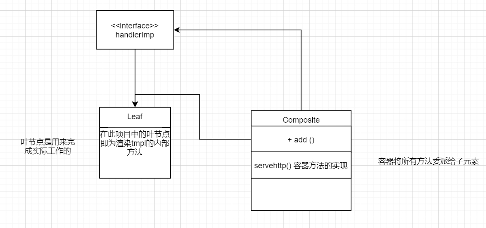

# 用go语言实现一个图书管理系统过程
## 1.http server搭建
```
http.ListenAndServe(":8080", handler)
```
* 该方法完成监听端口(listen)并处理进入端口的连接(serve)
### 关于handler
* 设置handler就是设置处理的程序
* 定义handler仅需要实现ServeHTTP(ResponseWriter, *Request)接口即可
```
// 设置handler
type handlerImp struct {
}

func (imp handlerImp) ServeHTTP(w http.ResponseWriter, r *http.Request) {
	w.Write([]byte("Hello, World!"))
}

func main() {
	http.ListenAndServe(":8080", handlerImp{})
}
```
* 设置路由的方法：在ServerHTTP中加入if r.URL.PATH == "/test"
* 当有多个路由或接口方法时，所有的执行逻辑都要通过ServeHTTP来完成，违反了高内聚低耦合
* 组合设计模式：
* 概念：组合模式是一种结构型的设计模式，你可以使用它将对象组合成树状结构，并且能像使用独立对象一样使用他们（指组合体）
* 优势：1.将类与对象组装成一个较大的结构并同时保持结构的灵活与高效性
* 	2.组合模式还符合开闭原则，不用修改原本的代码就可以添加新功能
* 
* 1.定义抽象组件接口 包含了对路径和HTTP方法的处理程序的存储和调用逻辑。
```
type handlerImp struct {
	pathHandlers   map[string]http.Handler
	methodHandlers map[string]http.Handler
}
```
* 2.实现叶子对象
```
func main() {
	
	handler := NewHandlerImp()
 	// 一个叶节点
	handler.AddPathHandler("/test", http.HandlerFunc(func(w http.ResponseWriter, r *http.Request) {
		fmt.Fprint(w, "Hello, World!")
	}))
	http.ListenAndServe(":8080", handler)
}

```
* 3.实现容器/组合
```
// 返回了一个handlerImp类型的实例，这是组合模式中的组合对象
func NewHandlerImp() handlerImp {
	return handlerImp{
		pathHandlers:   make(map[string]http.Handler),
		methodHandlers: make(map[string]http.Handler),
	}
}
// 添加子节点操作
func (imp handlerImp) AddPathHandler(path string, h http.Handler) {
	imp.pathHandlers[path] = h

}

func (imp handlerImp) AddMethodHandler(method string, h http.Handler) {
	imp.methodHandlers[method] = h
}
// 组合对象的实现
func (imp handlerImp) ServeHTTP(w http.ResponseWriter, r *http.Request) {
	if h, ok := imp.pathHandlers[r.URL.Path]; ok {
		h.ServeHTTP(w, r)
		return
	}

	if h, ok := imp.methodHandlers[r.Method]; ok {
		h.ServeHTTP(w, r)
		return
	}

	return
}
```
## 使用go http/template库 渲染html
* 直接将tmpl文件写入叶对象即可，只需要两步
* 1.解析模板
```
		tmpl, err := template.ParseFiles("D:\\Develop\\gopath\\book-manager\\web\\test.tmpl")
		if err != nil {
			fmt.Println("create template failed, err:", err)
			return
		}
```
* 2.可以给定数据渲染模板(应该也可以由result api操作)
```
		tmpl.Execute(w, "小明")
```
* tmpl
```
<!DOCTYPE html>
<html lang="zh-CN">
<head>
    <meta charset="UTF-8">
    <meta name="viewport" content="width=devie-width, initial-scale=1.0">
    <meta http-equiv="X-UA-Compatible" content="ie=edge">
    <title>Hello</title>
</head>
<body>
    <p>Hello {{.}}<p> #此处是渲染目标
</body>
<html>
```
* copy了一个登录html，等后期再修改
## 持久层设计

